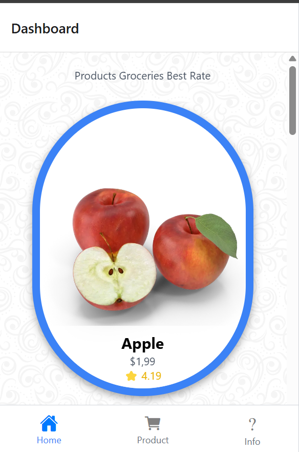
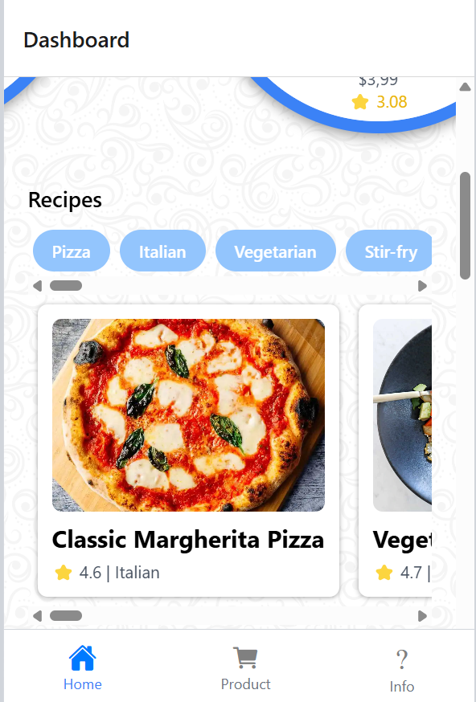
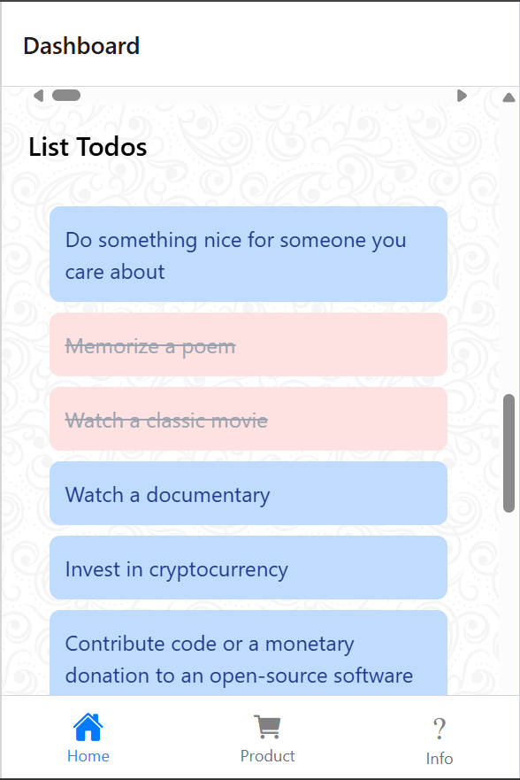
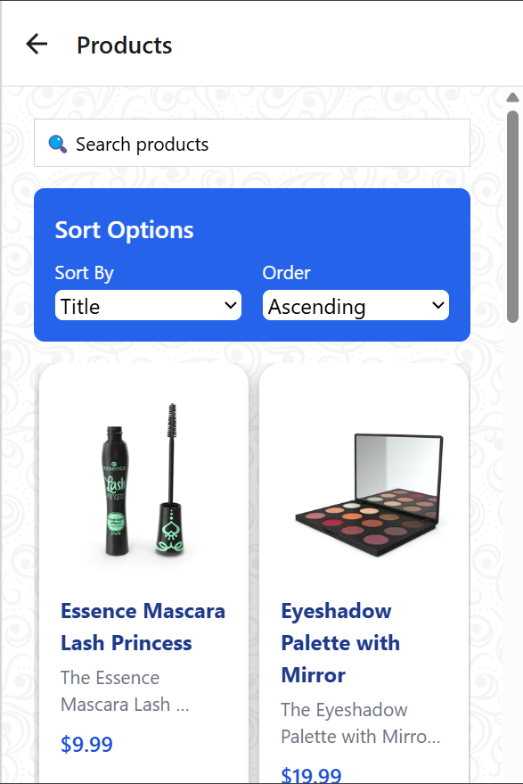
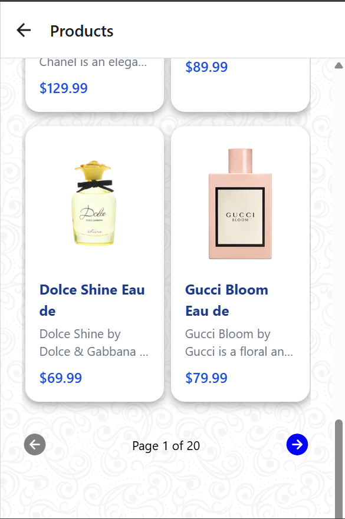
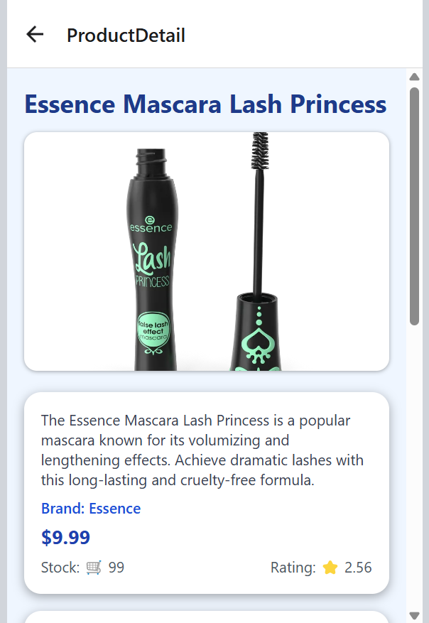
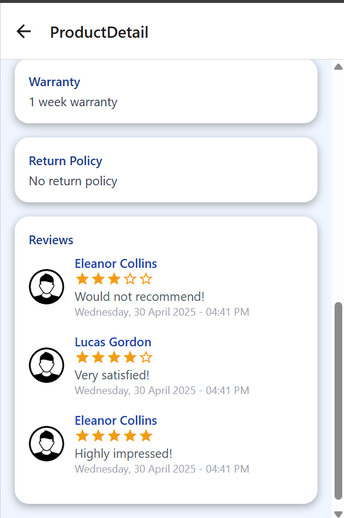
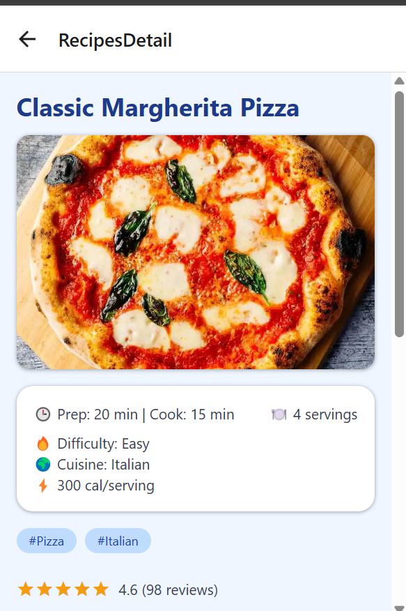
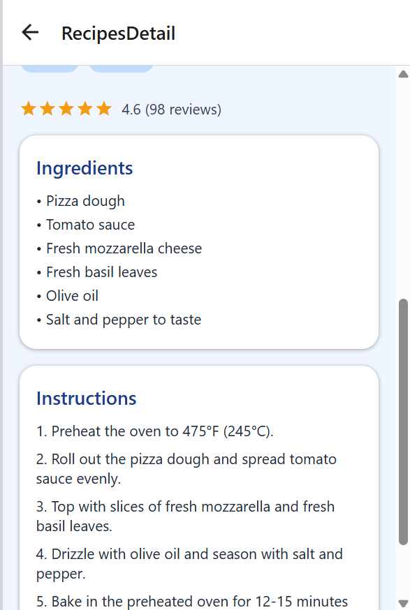

# 📱 React Native Project (Expo + TypeScript)

Ini adalah project mobile menggunakan React Native dengan Expo dan TypeScript. Styling menggunakan Tailwind CSS via NativeWind.

---

## 🔗 Demo

Demo aplikasi dapat diakses melalui [link berikut](https://expo-react-native-boilerplate.netlify.app/).

---

## 🧰 Teknologi yang Digunakan

- **Node.js** v18.18.2
- **Expo** (React Native)
- **TypeScript**
- **Tailwind CSS** dengan [NativeWind](https://www.nativewind.dev/)
- **Environment Variable** via `.env`
- **API** menggunakan [DummyJSON](https://dummyjson.com)

---

## 🚀 Cara Menjalankan Project di Lokal

Ikuti langkah-langkah berikut untuk menjalankan project di lokal:

1. **Clone repository**

   ```bash
   git clone https://github.com/FarhanMSiddiq/expo-react-native-boilerplate.git
   cd expo-react-native-boilerplate
   ```

2. **Install dependencies**

   ```bash
   npm install
   ```

3. **Buat file `.env` di root folder**, lalu isi dengan:

   ```
   API_URL=https://dummyjson.com
   ```

4. **Jalankan project**

   ```bash
   npx expo start --clear
   ```

> Pastikan kamu sudah menginstall `Node.js` dan `Expo CLI`.

---

## ✅ Halaman yang Sudah Selesai

- Halaman Dashboard Best Product
  <br/>
  

- Halaman Dashboard Recipes
  <br/>
  

- Halaman Dashboard Reviewer
  <br/>
  

- Halaman Dashboard Todo
  <br/>
  

- Halaman List Product Part 1
  <br/>
  

- Halaman List Product Part 2
  <br/>
  

- Halaman Detail Product Part 1
  <br/>
  

- Halaman Detail Product Part 2
  <br/>
  

- Halaman Detail Recipes Part 1
  <br/>
  

- Halaman Detail Recipes Part 2
  <br/>
  

- Recording Demo
  <br/>
  [🎬 Lihat Demo Video](https://youtube.com/shorts/yAgbW-75qwU)

---

## 📂 Struktur Folder

```bash
.
├── .env                     # File environment untuk konfigurasi API dan lainnya
└── src/
    ├── api/                # File terkait pemanggilan API (service, endpoint, dll)
    ├── app/
    │   ├── component/      # Komponen yang dapat digunakan ulang (Button, Card, dll)
    │   └── screens/        # Halaman/layar aplikasi (Home, Login, Detail, dll)
    ├── hooks/              # Custom React hooks
    └── models/             # Tipe data atau interface model (User, Product, dll)
```

---

## 📝 Catatan

- Project ini masih dalam tahap pengembangan.
- Jika menemukan bug, silakan buat issue atau pull request.

---

---

## ✅ Fitur yang Sudah Diimplementasikan

- 🔄 Pull to Refresh – Tersedia di halaman Product untuk memuat ulang data secara manual.
- 📄 Pagination, Sort, dan Search – Halaman Product sudah mendukung:
  - Pemuatan data bertahap (pagination)
  - Penyortiran berdasarkan berbagai kriteria
  - Pencarian produk
- 💾 Local Caching – Menggunakan AsyncStorage untuk menyimpan data secara lokal sebagai cache.
- ♻️ Custom Hook/API Handler Reuse – Menggunakan custom hook untuk pemanggilan API yang dapat digunakan ulang di berbagai bagian aplikasi.

---
